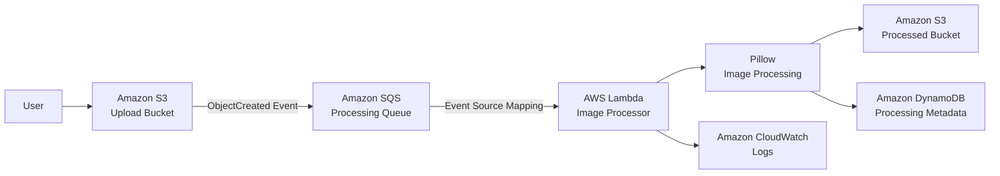
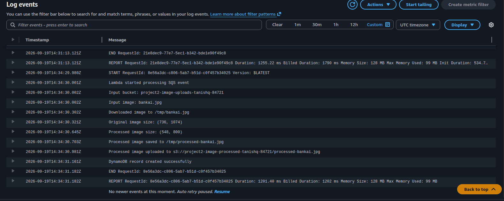
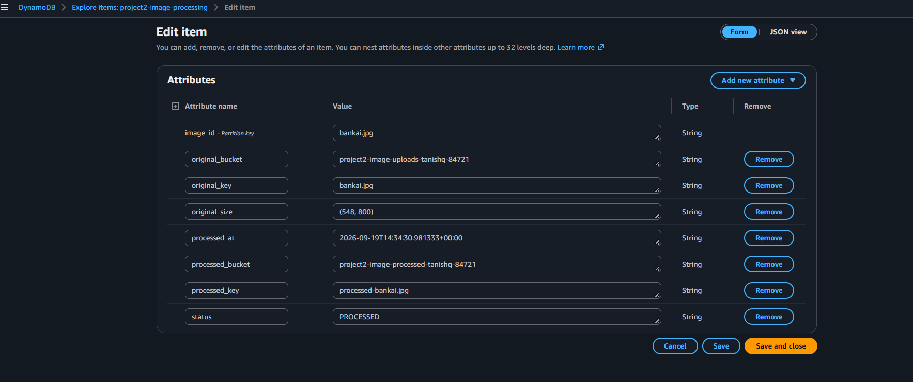

# AWS Serverless Image Processing Pipeline

An event-driven, serverless image processing system built on AWS that automatically resizes uploaded images, stores processed outputs, and records metadata with scalable, cost-efficient architecture.

## Architecture

## AWS Services

- **Amazon S3** – Stores original and processed images  
- **Amazon SQS** – Handles asynchronous message processing  
- **AWS Lambda** – Executes image processing logic  
- **Pillow** – Resizes images while preserving aspect ratio  
- **Amazon DynamoDB** – Stores image metadata  
- **AWS IAM** – Manages permissions  
- **Amazon CloudWatch** – Logging and monitoring  

## Workflow

1. User uploads an image to S3.  
2. S3 sends an event to SQS.  
3. Lambda processes the image using Pillow.  
4. The resized image is stored in a processed S3 bucket.  
5. Metadata is saved in DynamoDB.  
6. CloudWatch logs execution details.

## Example

**Input:** `736 × 1074`  
**Output:** `548 × 800`  
(Aspect ratio maintained)

## Key Features

- Event-driven architecture  
- Fully serverless design  
- Asynchronous processing with SQS  
- Automated image resizing  
- Metadata persistence with DynamoDB  
- Monitoring through CloudWatch  
- Secure IAM-based access control

## Screenshots

### S3 Upload

### Processed Image

### Lambda CloudWatch Logs

### DynamoDB Processing Record

### Lambda Pillow Layer

## Future Enhancements

- Dead Letter Queue (DLQ) support  
- Better error handling and retry mechanisms  
- Infrastructure as Code (Terraform / AWS SAM)  
- Automated testing and deployment  
